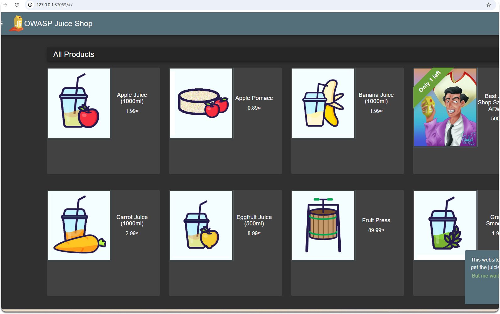

# SQL Injection Detection Lab

[](https://github.com/colossus06/sigma-soc-detection-lab/actions/workflows/ci.yml)


A complete hands-on lab for learning SQL injection exploitation and detection using modern security tools. This repository accompanies a three-part article series that takes you from basic PHP exploitation to enterprise-grade detection with Sigma rules on Kubernetes.



## What You'll Build

By the end of this lab, you'll have:

- A vulnerable PHP application for testing SQL injection techniques
- OWASP Juice Shop running on Minikube with full observability
- Falco monitoring syscalls, Zeek parsing network traffic
- Centralized logging with Fluent Bit and Loki
- Cross-platform detection rules using Sigma


## Lab Architecture

```
┌─────────────────┐    ┌─────────────────┐    ┌─────────────────┐
│   Juice Shop    │    │      Zeek       │    │     Falco       │
│  (Target App)   │────│ (Network Mon.)  │    │ (Syscall Mon.)  │
└─────────────────┘    └─────────────────┘    └─────────────────┘
         │                       │                       │
         └───────────────────────┼───────────────────────┘
                                 │
                    ┌─────────────────┐
                    │   Fluent Bit    │
                    │ (Log Collector) │
                    └─────────────────┘
                                 │
                    ┌─────────────────┐
                    │      Loki       │
                    │ (Log Storage)   │
                    └─────────────────┘
                                 │
                    ┌─────────────────┐
                    │    Grafana      │
                    │  (Visualization)│
                    └─────────────────┘
```

## Prerequisites

- Docker and Docker Compose
- Minikube or another Kubernetes cluster
- kubectl configured
- Helm 3.x
- curl for testing
- Python 3.8+ with pip (for Sigma)

## Learning Path

**📖 Read the complete article series first** to understand the concepts and methodology:

1. **[Time, Errors, and Unions: Practical SQL Injection Exploitation and Detection](https://podlock.readthedocs.io/blogs/k8s/time/time.html)** - Foundation concepts and PHP/MySQL exploitation
2. **[Building a Detection-Ready SOC Lab on Kubernetes: From Pod to Signal](https://podlock.readthedocs.io/blogs/k8s/soc/soc.html)** - Kubernetes observability with Falco, Zeek, and Loki  
3. **[SQL Injection Detection with Sigma](https://podlock.readthedocs.io/blogs/k8s/sigma/sigma.html)** - Cross-platform detection rules and automation

## Attack Techniques Covered

- **Authentication Bypass** - `OR 1=1` tautologies to bypass login
- **UNION-Based Injection** - Extract data from multiple tables
- **Error-Based Injection** - Use MySQL errors to leak information
- **Boolean Blind Injection** - Infer data through true/false responses
- **Time-Based Blind Injection** - Extract data using response timing

## Detection Methods

- **Network-Level** - Zeek scripts parsing HTTP traffic for injection patterns
- **System-Level** - Falco rules monitoring container behavior
- **Application-Level** - Log analysis for suspicious query patterns
- **Cross-Platform** - Sigma rules compiled for Loki, Elasticsearch, and Splunk

## Contributing

Found an issue or want to add more attack vectors? Please open an issue or submit a pull request. This lab is designed to be a living resource for the security community.

## Resources

- [OWASP SQL Injection Guide](https://owasp.org/www-community/attacks/SQL_Injection)
- [Sigma Detection Rules](https://github.com/SigmaHQ/sigma)
- [Zeek Network Monitor](https://zeek.org/)
- [Falco Runtime Security](https://falco.org/)

## License

MIT License - feel free to use this for training, research, or building your own detection labs.